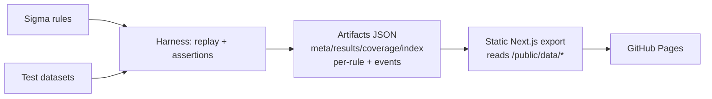

<p align="center">
  
</p>

# Detection Pack Lab — Sigma → Elastic + Validation Harness

Detection engineering portfolio that ships **detections + proof**:
**Sigma rules → Elastic queries → deterministic replay validation → CI artifacts → static evidence website** (offline, no backend).

<p align="center">
  <a href="#run-in-60-seconds-docker"><b>Run in 60 seconds</b></a> ·
  <a href="#what-i-built"><b>What I built</b></a> ·
  <a href="#skills-demonstrated"><b>Skills</b></a> ·
  <a href="#demo-in-90-seconds"><b>Demo (90s)</b></a> ·
  <a href="docs/TEST_REPORT.md"><b>End-to-end test report</b></a>
</p>

---

## Run in 60 seconds (Docker)
```bash
docker compose up --build
```
- Runs harness tests → generates artifacts → builds static site → serves at `http://localhost:3000`

## What I built
I built a small but production-style detection pack that proves detections work:
- **20 portable Sigma rules** in `rules/sigma/` (ATT&CK mapping, severity, FP notes).
- **Elastic query outputs** in `rules/elastic/` (best-effort KQL; ES|QL copy also supported in the site).
- **Deterministic replay harness** (Python) that validates rules against **synthetic JSONL logs** with **expected outcomes**.
- **Stable artifact contract** (`site/public/data/*`) validated via JSON Schema.
- **Static evidence website** (Next.js export) that visualizes detections, tests, replay, noise, coverage, diffs, and pack health using the artifacts only.
- **CI workflows + Docker** so anyone can run it quickly and get the same results.

## Project highlights
- Full detection lifecycle: author → convert → validate → ship artifacts → visualize evidence.
- Built like a real detection program: **repeatable validation**, **artifact contracts**, and **evidence-first UX**.

## Demo in 90 seconds
1) Open `/` → pass rate + pack scoreboard trend (history snapshot).
2) Open `/rules/` → search `T1098` or `IAM` → open a rule.
3) On `/rules/RULE-002/` → expected vs actual + “Why fired / Why didn’t”.
4) Replay Player → switch **Environment Profile** → alert count changes on benign replay.
5) Open `/noise/` → baseline vs suppressed estimates + tuning patch snippet.
6) Open `/diff/` → compare pack vs `public/data/history/` snapshot.

## Run locally
### 1) Harness tests (Python 3.11+)
```bash
python3 -m venv .venv
. .venv/bin/activate
pip install -r harness/requirements.txt
python harness/run.py test
```

### 2) Generate artifacts for the website
```bash
python harness/run.py artifacts
python harness/validate_artifacts.py
python scripts/feature_sanity.py
```

### 3) Build the static website
```bash
cd site
npm ci
npm run build
npm run export
```

## GitHub Pages deployment
- Workflow: `.github/workflows/pages.yml`
- One-time repo setting: enable Pages → “GitHub Actions” as the source.
- Base path supported (e.g. `/detpack-lab`) via `NEXT_PUBLIC_BASE_PATH` and `next.config.js`.

## How validation works
- Each rule has 2 replay datasets: `tests/cases/RULE-XXX/{benign,malicious}.jsonl`.
- `tests/cases/RULE-XXX/expected.json` defines expected alert counts per dataset.
- The harness evaluates Sigma (subset) deterministically and generates:
  - pack summary (`meta.json`, `results.json`, `coverage.json`, `rules_index.json`)
  - per-rule detail (`site/public/data/rules/RULE-XXX.json`)
  - exported replay streams (`site/public/data/events/RULE-XXX_*.jsonl`)

## Skills demonstrated
Proof-first skills, with where to find the evidence:

| Skill area | What I implemented | Where to look |
|---|---|---|
| Detection engineering | Sigma authoring, severity, false positive notes, ATT&CK mapping | `rules/sigma/`, `docs/mapping.md`, `docs/tuning.md` |
| SIEM query design | Best-effort Sigma→Elastic KQL conversions and copy-as suite | `rules/elastic/`, `site/components/CopyAsButtons.tsx` |
| Validation engineering | Deterministic replay, expected outcomes, explainable “why” output | `harness/evaluate.py`, `tests/cases/`, `site/public/data/results.json` |
| Data contracts | JSON Schema validation + sanity checks for artifacts | `harness/schemas.py`, `harness/validate_artifacts.py` |
| CI/CD | Tests → artifacts → static build → Pages deploy | `.github/workflows/ci.yml`, `.github/workflows/pages.yml` |
| Docker/DevEx | Single-command runnable demo with HTTP checks | `docker-compose.yml`, `scripts/http_sanity.py` |
| Frontend evidence UX | Artifact-driven UI with replay, noise lab, story mode, diff/history | `site/app/`, `site/components/` |

## Site pages (all offline; backed by artifacts)
- `/` — dashboard + pack scoreboard + trend (history-aware)
- `/rules` — rule explorer (search + filters + sort)
- `/rules/RULE-XXX` — Sigma/KQL/ES|QL, replay player + profiles, “why”, tuning simulator, snapshot diff + impact
- `/coverage` — ATT&CK matrix (click technique → rules)
- `/noise` — noise lab (baseline vs suppressed + tuning patch snippet)
- `/diff` — pack diff vs history snapshot
- `/schema` — schema coverage analyzer (field reliance + brittleness)
- `/stories` — kill-chain story mode (timeline across multiple detections)

## Repo map
- `rules/sigma/` — Sigma rules (`RULE-001` … `RULE-020`)
- `rules/elastic/` — Elastic KQL conversions
- `tests/cases/` — per-rule datasets + expected outcomes
- `harness/` — evaluation engine + artifacts generator + JSON schema validators
- `site/` — static Next.js evidence site (reads `public/data/*`)
- `site/public/data/history/` — example prior snapshot for diff/trend features

## Architecture (CI-driven)


## Artifacts contract (validated)
The harness enforces JSON Schema validation for:
- `site/public/data/meta.json`
- `site/public/data/rules_index.json`
- `site/public/data/results.json`
- `site/public/data/coverage.json`
- `site/public/data/rules/RULE-XXX.json` (per-rule details + compiled matcher for client replay)

## Release notes
See `docs/RELEASE_NOTES.md` (and `CHANGELOG.md` for version history).

## Limitations
- Sigma evaluation supports a pragmatic subset (field equality + string operators + numeric comparisons + boolean `condition` logic).
- Elastic conversions are best-effort KQL for demo rules (not a full Sigma backend).

## Roadmap
- Add more rules + richer semantics (thresholding, grouping, aggregation-style detections)
- Add more history snapshots and pack regression gates
- Add mapping presets for ECS normalization per logsource
