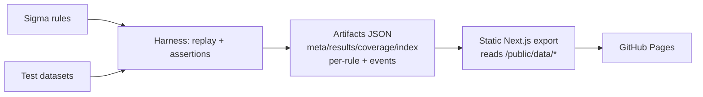

<p align="center">
  
</p>

# Detection Pack Lab — Sigma → Elastic + Validation Harness

**Detection engineering portfolio repo** that ships **detections + proof**:
Sigma rules → Elastic queries → deterministic replay validation → artifact-driven static evidence site (CI-verifiable, offline).

<p align="center">
  <a href="#run-in-60-seconds-docker"><b>Run in 60 seconds</b></a> ·
  <a href="#what-you-built"><b>What you built</b></a> ·
  <a href="#skills-demonstrated"><b>Skills</b></a> ·
  <a href="#demo-in-90-seconds"><b>90s demo</b></a> ·
  <a href="docs/TEST_REPORT.md"><b>Test report</b></a>
</p>

---

## Run in 60 seconds (Docker)
```bash
docker compose up --build
```
- Runs harness tests → generates artifacts → builds static site → serves at `http://localhost:3000`

## What you built
- **20 Sigma rules** in `rules/sigma/` with ATT&CK tags and FP/tuning notes.
- **20 Elastic query equivalents** in `rules/elastic/` (best-effort KQL for demo portability).
- **Replay validation harness (Python)** that replays synthetic JSONL logs and asserts expected rule firing.
- **Static evidence site (Next.js export)** that renders **only** from `site/public/data/*` artifacts (no backend).
- **CI pipeline + Pages deploy** so the website always matches the latest test results.

## Why this is recruiter-friendly
- It’s not “just rules” — every rule has **evidence**, an **expected outcome**, and a **CI-verified proof page**.
- The site lets you **replay events**, see **why a rule matched**, simulate **environment tuning**, and compare **pack diffs** across snapshots.

## Demo in 90 seconds
1) Open `/` → pass rate + pack scoreboard trend (history snapshot).
2) Open `/rules/` → search “IAM” or “T1098” → click a rule.
3) On `/rules/RULE-002/` → “Why fired / Why didn’t” + Validation Proof.
4) Use Replay Player → switch **Environment Profile** → watch alert count change.
5) Open `/noise/` → baseline vs suppressed estimates + patch snippet.
6) Open `/diff/` → show pack changes vs `public/data/history/`.

## Run locally
### 1) Harness tests (Python 3.11+)
```bash
python3 -m venv .venv
. .venv/bin/activate
pip install -r harness/requirements.txt
python harness/run.py test
```

### 2) Generate artifacts for the website
```bash
python harness/run.py artifacts
python harness/validate_artifacts.py
python scripts/feature_sanity.py
```

### 3) Build the static website
```bash
cd site
npm ci
npm run build
npm run export
```

## GitHub Pages deployment
- Workflow: `.github/workflows/pages.yml`
- One-time repo setting: enable Pages → “GitHub Actions” as the source.
- Base path supported (e.g. `/detpack-lab`) via `NEXT_PUBLIC_BASE_PATH` and `next.config.js`.

## How validation works
- Each rule has 2 replay datasets: `tests/cases/RULE-XXX/{benign,malicious}.jsonl`.
- `tests/cases/RULE-XXX/expected.json` defines expected alert counts per dataset.
- The harness evaluates Sigma (subset) deterministically and generates:
  - pack summary (`meta.json`, `results.json`, `coverage.json`, `rules_index.json`)
  - per-rule detail (`site/public/data/rules/RULE-XXX.json`)
  - exported replay streams (`site/public/data/events/RULE-XXX_*.jsonl`)

## Site pages (all offline; backed by artifacts)
- `/` — dashboard + pack scoreboard + trend (history-aware)
- `/rules` — rule explorer (search + filters + sort)
- `/rules/RULE-XXX` — Sigma/KQL/ES|QL, replay player + profiles, “why”, tuning simulator, snapshot diff + impact
- `/coverage` — ATT&CK matrix (click technique → rules)
- `/noise` — noise lab (baseline vs suppressed + tuning patch snippet)
- `/diff` — pack diff vs history snapshot
- `/schema` — schema coverage analyzer (field reliance + brittleness)
- `/stories` — kill-chain story mode (timeline across multiple detections)

## Repo map
- `rules/sigma/` — Sigma rules (`RULE-001` … `RULE-020`)
- `rules/elastic/` — Elastic KQL conversions
- `tests/cases/` — per-rule datasets + expected outcomes
- `harness/` — evaluation engine + artifacts generator + JSON schema validators
- `site/` — static Next.js evidence site (reads `public/data/*`)
- `site/public/data/history/` — example prior snapshot for diff/trend features

## Architecture (CI-driven)


## Skills demonstrated
- Detection engineering: Sigma authoring, ATT&CK mapping, FP/tuning documentation
- Validation: deterministic replay harness, expected outcomes, explainable “why” reasoning
- Data/quality engineering: stable artifact contracts + schema validation + pack health metrics
- DevOps/CI: GitHub Actions pipeline, reproducible Docker “one command” demo, Pages deploy-ready
- Product thinking: evidence-first UX (replay, noise lab, story mode, diff/history)

## Artifacts contract (validated)
The harness enforces JSON Schema validation for:
- `site/public/data/meta.json`
- `site/public/data/rules_index.json`
- `site/public/data/results.json`
- `site/public/data/coverage.json`
- `site/public/data/rules/RULE-XXX.json` (per-rule details + compiled matcher for client replay)

## Release notes
See `docs/RELEASE_NOTES.md` (and `CHANGELOG.md` for version history).
