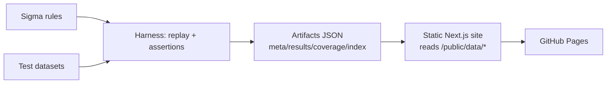

# Detection Pack Lab — Sigma → Elastic + Validation Harness (CI-verified detections + interactive evidence website)

Production-style detection engineering portfolio repo: portable Sigma rules, best-effort Elastic conversions, deterministic replay validation, and a static “evidence website” generated from CI artifacts.

## Run in 60 seconds (Docker)
```bash
docker compose up --build
```
- Runs harness tests → generates artifacts → builds static site → serves at `http://localhost:3000`

## Run locally
### 1) Harness tests (Python 3.11+)
```bash
python -m venv .venv
. .venv/bin/activate
pip install -r harness/requirements.txt
python harness/run.py test
```

### 2) Generate artifacts for the website
```bash
python harness/run.py artifacts
```

### 3) Build the static website
```bash
cd site
npm ci
npm run build
npm run export
```

## GitHub Pages deployment
- Workflow: `.github/workflows/pages.yml`
- One-time repo setting: enable Pages → “GitHub Actions” as the source.

## How validation works
- Each rule has two replay datasets: `benign.jsonl` and `malicious.jsonl` under `tests/cases/RULE-XXX/`.
- The harness loads the Sigma YAML, evaluates it against each JSONL event stream, and asserts expected alert counts from `expected.json`.
- The harness writes CI-grade artifacts into `site/public/data/` so the website always matches test results.

## Site pages (all offline; backed by artifacts)
- `/` — dashboard + pack scoreboard (trend uses `public/data/history/` if present)
- `/rules` — rule explorer
- `/rules/RULE-XXX` — Sigma/KQL viewers, replay player (with environment profiles), “why”, noise/tuning simulator, snapshot diff + alert impact
- `/coverage` — ATT&CK matrix
- `/noise` — noise lab (baseline vs suppressed estimates + patch snippets)
- `/diff` — pack diff vs history
- `/schema` — schema coverage analyzer
- `/stories` — kill-chain story mode with interactive timeline

## Repo map
- `rules/sigma/` — portable Sigma rules (`RULE-001` … `RULE-020`)
- `rules/elastic/` — best-effort Elastic KQL equivalents
- `tests/cases/` — per-rule benign/malicious datasets + expected outcomes
- `harness/` — replay engine, Sigma→Elastic scaffold, artifacts generator, JSON schema validation
- `site/` — Next.js static evidence website (no backend; reads `public/data/*`)
- `.github/workflows/` — CI pipeline + GitHub Pages deployment

## Architecture (CI-driven)


## Skills demonstrated
- Sigma authoring + constraints for portability
- Best-effort translation to Elastic KQL with explainable limitations
- Deterministic validation harness (CI-friendly, fast, synthetic data)
- Artifact-driven documentation and visualization (recruiter-first “proof”)
- ATT&CK mapping + pack health metrics + tuning workflow

## Artifacts contract (validated)
The harness enforces JSON Schema validation for:
- `site/public/data/meta.json`
- `site/public/data/rules_index.json`
- `site/public/data/results.json`
- `site/public/data/coverage.json`
- `site/public/data/rules/RULE-XXX.json` (per-rule details + compiled matcher for client replay)

## Limitations
- Sigma parsing/evaluation supports a pragmatic subset (`equals`, `contains`, `startswith`, `endswith`, numeric comparisons, and boolean conditions).
- Elastic conversions are best-effort KQL for demo rules (not a full sigma backend).

## Roadmap
- Add ECS normalization presets per logsource
- Add richer rule semantics (thresholding, aggregations)
- Add historical trend artifacts (pass-rate over time)
